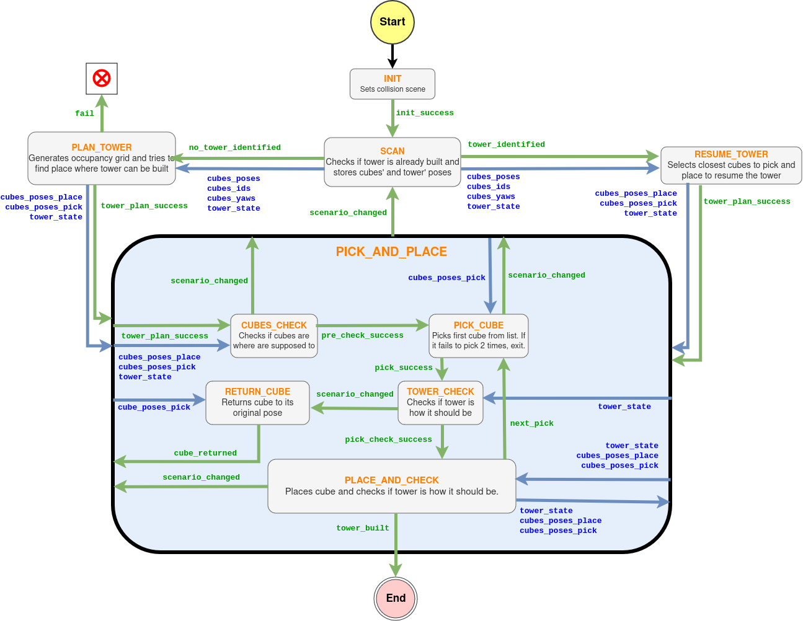

# Frankastadt

This repository was developed for the Project Lab "Intelligent Robotic Manipulation" from the Computer Science Department, offered by the Pearl Lab at Technische Universität Darmstadt. The purpose of the project was to make the Franka Panda robot build a tower of cubes with pick and place. The challenges included a good 3D pose estimation of the cubes as well as good recovery features after human interferences. All code was developed in Python and run with ROS Noetic. The camera used was the ZED2 and the estimation was made using pointcloud as well as RGBD. For the planning, we implemented a state machine that allows the robot to replan if the cubes change place on the table or if the tower gets destroyed midway. For more information, you can check our final report.

<p align="center">
    
</p>

<p align="center">
  
</p>

## State machine

THe state machine was designed suing the `smach` package. It requires a remapping of the data flow between states that are indicated with blue arrows. The transitions are indicated with green arrows.

<p align="center">
  
</p>

## Docker
A Docker with all the necessary packages for runnnig the code in simlation. Some necessary packages include `smach`,`libfranka`,`franka_ros`, `panda_moveit_config`, Matplotlib, OpenCV, Open3D, etc:

```
docker pull sophiamoyen/frankastadt:simulation
```

For running the code on the real robot, a different base image with CUDA is needed in order to use the ZED2 camera. Some additional packages may need to be installed:

```
docker pull 3liyounes/pearl_robots:franka
```

> [!NOTE]
> For installing docker, you can follow the [Pearl Lab instructions](https://github.com/iROSA-lab/Docker_env)

>[!TIP]
> Remember to allow any external programm X11 to access the GUI: 
> ```
> xhost +
> ```

## Running on the real robot
Once the robot has the FCI activated and is in execution mode, you can launch it with transformation for the camera with:

```
roslaunch  fs_pick_and_place robot_camera.launch
```

Then you can make the robot go to standard pose:

``` 
rosrun fs_pick_and_place standard_pose.py
```

Now that the robot has a good view of the scene, we can launch the perception pipeline:
```
roslaunch fs_pick_and_place perception.launch
```

Finally you can run the state machine, sit and enjoy the show:
```
rosrun fs_pick_and_place state_machine.py
```

>[!TIP]
> You can visualize the state machine in real time running: 
> ```
> rosrun smach_viewer smach_viewer.py
> ```

>[!WARNING]
> Remember to keep the emergency button close at all times


## Running in simulation

To run the code in simulation, you will need to have the [`franka_zed_gazebo`](https://github.com/iROSA-lab/franka_zed_gazebo) package to launch the robot, the camera and the cubes. On top of the `edge_detection.py`,`tower.py` and `pc_perception.py`, a hyperparamter for running in simulation has to be changed. Then you can follow the same instructions as in the real robot.

## The team

This project was developed by Sophia Moyen, Marvin Heidinger, Tessa Wlodarczak & Vojin Vlacic with guidance from Sohan Rundra and Jiayun. The whole project was overseen by prof.Georgia Chalvatzaki.

<p align="center">
  
</p>


### Useful sources
<ul>
<li>[1] https://github.com/cdbharath/franka_panda/</li>
<li>[3] https://frankaemika.github.io/docs/</li>
<li>[4] https://ros-planning.github.io/moveit_tutorials/doc/pick_place/pick_place_tutorial.html</li>
</ul>

